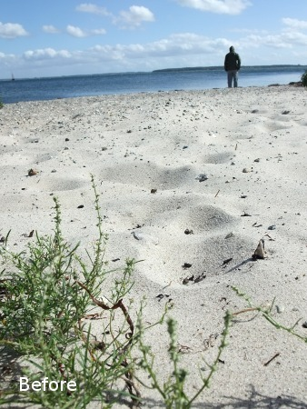
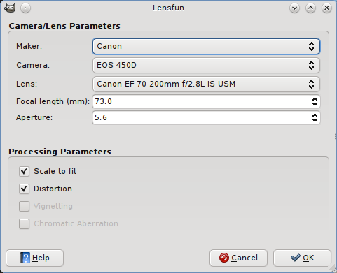

# GimpLensfun

### About
GimpLensfun is a <a href="http://www.gimp.org" target=_blank">Gimp</a> plugin to correct lens distortion
using the <a href="http://lensfun.berlios.de/" target="_blank">lensfun</a> library and database. 

Move mouse over the example image to see the effect after lens correction.  
This image has been taken using a Fuji F200EXR compact camera in wide
angle position and the distortion is clearly visible at the curved
horizon in the original shoot.

 
 
 
 
Screenshot from GIMP 
 

You find the plugin under "Filters > Enhance > GimpLensfun".

It autodetects your camera, lens type and corresponding parameters from the EXIF information embedded in the image file. Please check if it matches the equipment you took the photo with. Otherwise distortion correction would not work as expected.

### Latest news



{{ post.date | date: "%Y-%m-%d" }} {{ post.title }}

{{ post.content }}



### Download

#### Linux ####

Some distributions already include a package or there are third party repositories with the most up-to-date version.

* <a href="https://launchpad.net/~otto-kesselgulasch/+archive/gimp" target="_blank">Ubuntu Launchapd PPA</a>
* ...

Alternatively the following package includes the sources and also a pre-compiled 32/64-bit binary.
<a href="http://dl.bintray.com/content/seebk/GIMP-Lensfun/gimplensfun-0.2.3.tar.gz?direct">gimplensfun-0.2.3.tar.gz</a> (66 kB)

#### Windows ####

Finally there is an installer for windows again. Although it worked for me I would rate it as experimental. It directly writes into the GIMP install directory. There is no separate uninstaller, instead GIMP-Lensfun is removed when you uninstall GIMP.

<a href="http://dl.bintray.com/content/seebk/GIMP-Lensfun/gimplensfun-0.2.3-setup.exe?direct">gimplensfun-0.2.3-setup.exe</a> (1.5 MB)

You should use the offical GIMP 2.8.4 build from <a href="http://gimp-win.sourceforge.net/stable.html" target="_blank">http://gimp-win.sourceforge.net/stable.html</a>.

#### Sources ####

Sources are available from github:
<a target="_blank" href="https://github.com/seebk/GIMP-Lensfun">https://github.com/seebk/GIMP-Lensfun</a>

### Install

#### Pre-compiled binary

Unzip the archive:

&gt;$ tar -xvzf gimplensfun-0.x.tar.gz

Binaries can then be found under gimplensfun-0.x/bin/linux/. 
Select the corresponding architecture for your system (i386/amd64) and copy
the binary file "gimplensfun" to your GIMP plugin folder.
Usually this is located at "/home/USER/.gimp-2.8/plug-ins/".
Afterwards you need to restart GIMP to detect the new plugin.

#### From Source

Dependencies: libgimp2.0, libexiv2, liblensfun

On (K)Ubuntu you can easily install the required libs by

&gt;$ sudo apt-get install build-essential libgimp2.0-dev libexiv2-dev liblensfun-dev

On Fedora 15 (and probably other versions, too) you need to install these packages

gcc, gcc-c++, gimp-devel-tools, lensfun-devel, exiv2-devel

Afterwards get the sources from github:

&gt;$ git clone git://github.com/seebk/GIMP-Lensfun.git

Enter the directory and compile with "make":

    &gt;$ cd GIMP-Lensfun 
    &gt;$ make

If all went fine copy the newly created binary file "gimplensfun" to your GIMP
plugins folder. Normally you find this at "/home/USER/.gimp-2.8/plug-ins/".

You need to restart GIMP to detect the new plugin.

###Supported Cameras/Lenses

Wether your camera/lens combination is supported depends on
the database that comes with the lensfun library installed on your
computer. Lensfun usually reads the distortion parameters from xml
files located under /usr/share/lensfun.

If your lens/camera combination is not part of the database it's no
problem: Measuring the correction parameters is easy and can be
done by yourself. Just follow  
<a href="http://lensfun.berlios.de/lens-calibration/lens-calibration.html" target="_blank">this tutorial</a> 
on the lensfun
homepage.  
Afterwards please email the lens profile to mail(at)sebastiankraft.net and I will add it to the database. 

<a href="lenslist.html" target="_blank">List with supported lenses</a> 

### Contact
For contact please send an email to

mail (at) sebastiankraft.net

